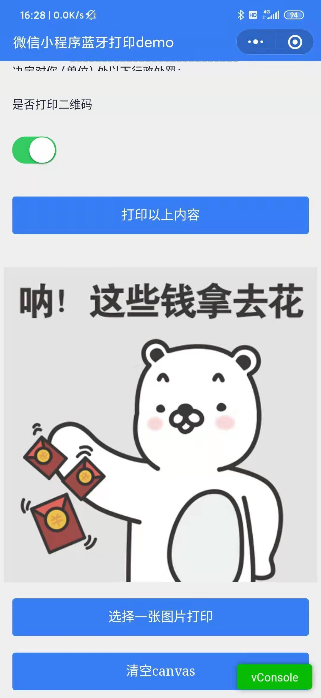
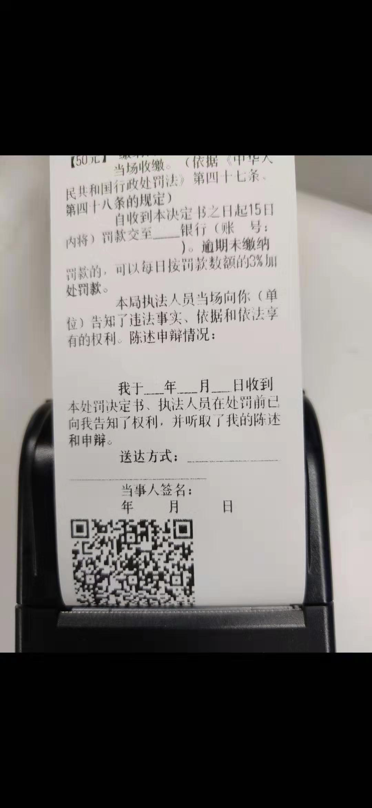

# 微信小程序连接蓝牙打印机示例

小程序连接蓝牙打印机打印文本与二维码等示例在 github 上都能找到一些，唯独打印图片这个案例几乎没有。最早在 CSDN 找到 [微信小程序蓝牙连接 TSPL 打印机打印图片思路](https://blog.csdn.net/a513908329/article/details/89640792) 这篇文章，代码完整性很缺，被坑一周。继续找资料摸索解决了打印图片这个问题。

-   测试打印机：[凯盛诺 PTP-II-UBC 58mm 便携热敏打印机](http://www.csntek.cn/cn/show/270)
-   测试环境有：Android , IOS；其中 Android 和 IOS 在打印文本与二维码速率相对一致，但 IOS 打印图片几乎慢到无法打印的情况(听说蓝牙打印机在 IOS 中受限制，需要与 IOS 合作授权，在斑马品牌的一款打印机用 IOS 就能打印出来)
-   指令类型：ESC/POS 指令集 (打印机产家都会提供对应的指令文档，demo 中使用十进制的数据格式的指令，十六进制的指令使用方式可以参考另一个示例[小程序蓝牙打印 miniprogram-bluetoothprinter](https://github.com/benioZhang/miniprogram-bluetoothprinter))

## 已实现情况

-   连接蓝牙打印机
-   打印文本
-   打印二维码
-   打印任意图片

## 效果图






## Demo 中连接打印机的流程

-   初始化蓝牙模块 wx.openBluetoothAdapter()
-   初始化完成后搜寻附近的蓝牙设备 wx.startBluetoothDevicesDiscovery()
-   监听寻找到新设备的事件 wx.onBluetoothDeviceFound()
-   在监听寻找到新设备的事件回调中获取所有蓝牙设备列表 wx.getBluetoothDevices()
-   连接低功耗蓝牙设备 wx.createBLEConnection()
-   连接成功后获取蓝牙设备服务 wx.getBLEDeviceServices()
-   在服务中取(notify=true || indicate=true) && write=true 的特征值的 uuid: wx.getBLEDeviceCharacteristics()
-   完成后停止搜寻 wx.stopBluetoothDevicesDiscovery()
-   向低功耗蓝牙设备特征值中写入二进制数据 wx.writeBLECharacteristicValue()
-   离开页面时取消蓝牙连接 wx.closeBLEConnection()
-   关闭蓝牙模块 wx.closeBluetoothAdapter()

## 关于找蓝牙设备中能用的 Characteristic，这里贴出对应的代码，关注注释部分

```js
//在多个服务services中递归查找能用的特征值
export function getDeviceCharacteristics(deviceId, services = [], success, fail) {
    services = services.slice(0);
    if (services.length) {
        const serviceId = services.shift().uuid;
        wxAsyncPromise('getBLEDeviceCharacteristics', {
            deviceId,
            serviceId,
        })
            .then((res) => {
                console.log('getBLEDeviceCharacteristics', deviceId, serviceId, res);
                let finished = false;
                let write = false;
                let notify = false;
                let indicate = false;
                //有斑马品牌的一款打印机中res.characteristics的所有uuid都是相同的，找所有的properties存在(notify || indicate) && write（如果只写入数据只要write=true也可以）这种情况就说明这个uuid是可用的（不确保所有的打印机都能用这种方式取得uuid,在凯盛诺打印机的res.characteristic只有一个uuid,所以也能用这个方式）
                for (var i = 0; i < res.characteristics.length; i++) {
                    if (!notify) {
                        notify = res.characteristics[i].properties.notify;
                    }
                    if (!indicate) {
                        indicate = res.characteristics[i].properties.indicate;
                    }
                    if (!write) {
                        write = res.characteristics[i].properties.write;
                    }
                    if ((notify || indicate) && write) {
                        /* 获取蓝牙特征值uuid */
                        success &&
                            success({
                                serviceId,
                                characteristicId: res.characteristics[i].uuid,
                            });
                        finished = true;
                        break;
                    }
                }

                if (!finished) {
                    getDeviceCharacteristics(deviceId, services, success, fail);
                }
            })
            .catch((res) => {
                getDeviceCharacteristics(deviceId, services, success, fail);
            });
    } else {
        fail && fail();
    }
}
```

## 打印图片

### 图片来源

在 Demo 中手机选任意一张图片用 canvas 绘制，wx.canvasGetImageData()取得 Uint8ClampedArray 类型的图像像素点数据。

### 位图数据

需要把 Uint8ClampedArray 类型的数据转成打印机识别的点阵位图数据（也可以让后台实现图片转位图数据，参考[热敏打印机编程 ESC/POS 指令](https://www.jianshu.com/p/dd6ca0054298)）。

### 贴出 Uint8ClampedArray 转位图数据的代码

```js
/**
 * overwriteImageData
 * @param {object} data
 * {
            width,//图片宽度
            height,//图片高度
            imageData,//Uint8ClampedArray
    }
 */
export function overwriteImageData(data) {
    let sendWidth = data.width,
        sendHeight = data.height;
    const threshold = data.threshold || 180;
    let sendImageData = new ArrayBuffer((sendWidth * sendHeight) / 8);
    sendImageData = new Uint8Array(sendImageData);
    let pix = data.imageData;
    const part = [];
    let index = 0;
    for (let i = 0; i < pix.length; i += 32) {
        //横向每8个像素点组成一个字节（8位二进制数）。
        for (let k = 0; k < 8; k++) {
            const grayPixle1 = grayPixle(pix.slice(i + k * 4, i + k * 4 + (4 - 1)));
            //阈值调整
            if (grayPixle1 > threshold) {
                //灰度值大于threshold位   白色 为第k位0不打印
                part[k] = 0;
            } else {
                part[k] = 1;
            }
        }
        let temp = 0;
        for (let a = 0; a < part.length; a++) {
            temp += part[a] * Math.pow(2, part.length - 1 - a);
        }
        //开始不明白以下算法什么意思，了解了字节才知道，一个字节是8位的二进制数，part这个数组存的0和1就是二进制的0和1，传输到打印的位图数据的一个字节是0-255之间的十进制数，以下是用权相加法转十进制数，理解了这个就用上面的for循环替代了
        // const temp =
        //     part[0] * 128 +
        //     part[1] * 64 +
        //     part[2] * 32 +
        //     part[3] * 16 +
        //     part[4] * 8 +
        //     part[5] * 4 +
        //     part[6] * 2 +
        //     part[7] * 1;
        sendImageData[index++] = temp;
    }
    return {
        array: Array.from(sendImageData),
        width: sendWidth / 8,
        height: sendHeight,
    };
}
```

### 贴出递归发送二进制数据到蓝牙的代码

```js
/**
 * sendDataToDevice
 * @param {object} options
 * {
            deviceId,
            serviceId,
            characteristicId,
			value [ArrayBuffer],
			lasterSuccess,
    }
 */
export function sendDataToDevice(options) {
    let byteLength = options.value.byteLength;
    //这里默认一次20个字节发送
    const speed = options.onceByleLength || 20;
    if (byteLength > 0) {
        wxAsyncPromise('writeBLECharacteristicValue', {
            ...options,
            value: options.value.slice(0, byteLength > speed ? speed : byteLength),
        })
            .then((res) => {
                if (byteLength > speed) {
                    sendDataToDevice({
                        ...options,
                        value: options.value.slice(speed, byteLength),
                    });
                } else {
                    options.lasterSuccess && options.lasterSuccess();
                }
            })
            .catch((res) => {
                console.log(res);
            });
    }
}
```

### 贴出发送逐行图片数据的代码

```js
/**
 * printImage
 * @param {object} opt
 * {
            deviceId,//蓝牙设备id
            serviceId,//服务id
            characteristicId,//可用特征值uuid
            lasterSuccess , //最后完成的回调
	}
 * @param {object} imageInfo // 由overwriteImageData返回的对象
 */
export function printImage(opt = {}, imageInfo = {}) {
    let arr = imageInfo.array,
        width = imageInfo.width;
    const writeArray = [];
    const xl = width % 256;
    const xh = width / 256;
    //分行发送图片数据,用的十进制指令
    const command = [29, 118, 48, 0, xl, xh, 1, 0];
    for (let i = 0; i < arr.length / width; i++) {
        const subArr = arr.slice(i * width, i * width + width);
        const tempArr = command.concat(subArr);
        writeArray.push(new Uint8Array(tempArr));
    }
    const print = (options, writeArray) => {
        if (writeArray.length) {
            sendDataToDevice({
                ...options,
                value: writeArray.shift().buffer,
                lasterSuccess: () => {
                    if (writeArray.length) {
                        print(options, writeArray);
                    } else {
                        options.lasterSuccess && options.lasterSuccess();
                    }
                },
            });
        }
    };
    print(opt, writeArray);
}
```

## 主要参考

-   [微信低功率蓝牙](https://developers.weixin.qq.com/community/develop/doc/0008acd004ccd86b37d649ee55b009?highLine=%25E8%2593%259D%25E7%2589%2599)
-   [小程序蓝牙打印 miniprogram-bluetoothprinter](https://github.com/benioZhang/miniprogram-bluetoothprinter)
-   [热敏打印机编程 ESC/POS 指令](https://www.jianshu.com/p/dd6ca0054298)

## 安利

- [微信小程序组件库wux-weapp](https://wux-weapp.github.io/wux-weapp-docs/?cache=712#/introduce)